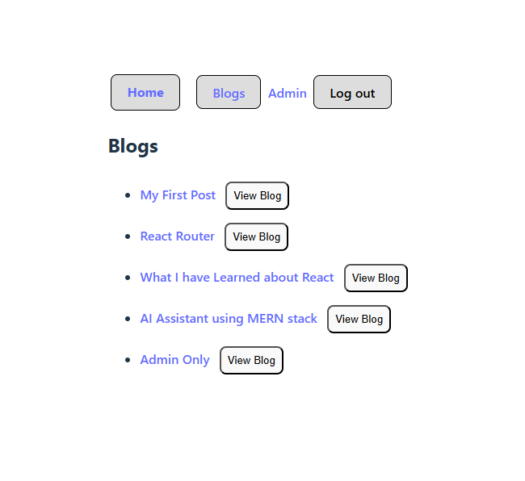

## Project Title

Dynamic Routing & Protected Routes (React Router)

## My Solution Screenshot:

## How to Use App

- cd into your project folder in VS Code

- npm run dev

- The app will open in your default browser

- Click Blog to view all public blog posts

- Click a blog title to view an individual post (dynamic routing using URL params)

- Each blog post includes a Go Back button next to the title

- Click Admin Only (visible only when logged in)

- If logged out, attempting to access admin-only content redirects to Login

- After logging in, the user is redirected back to the page they originally tried to access

- Click Log Out to remove access to protected content

## Challenges

1. One of the main challenges I faced was understanding the difference between programmatic navigation and render-based redirection in React Router.

- At first, I confused:

  - navigate() from useNavigate

  - <Navigate /> as a component

  This caused errors when trying to protect routes. I resolved this by learning that:

  - useNavigate() is used for navigation triggered by events (button clicks)

  - <Navigate /> is used to conditionally redirect during render

2. Another challenge was working with dynamic route parameters (useParams) and ensuring that protected blog posts could not be accessed directly via URL when logged out.

- I solved this by adding authentication checks inside the blog post page and redirecting unauthenticated users to the login page.

- I also had to carefully manage conditional rendering so that the “Admin Only” post only appears in the blog list when the user is authenticated, while still preventing manual URL access.

## Reflection

I handled protected content by separating visibility control from access control to ensure both a good user experience and proper security. On the UI level, I filtered the blog posts displayed on the Blog index page so that the “Admin Only” post is only visible when the user is authenticated. This prevents unauthenticated users from seeing protected content links in the first place. On the route level, I added an authentication check inside the individual blog post page itself and used the <Navigate /> component to redirect unauthenticated users to the login page if they attempted to access protected content directly via the URL. By combining conditional rendering with route-based protection, I ensured that protected content is both hidden from view and inaccessible without proper authentication.

## Acknowledgement

https://reactrouter.com/api/hooks/useLocation

https://api.reactrouter.com/v7/functions/react_router.useLocation.html

https://www.youtube.com/watch?v=16yMmAJSGek

https://www.youtube.com/watch?v=i6A5iEmbCJM
